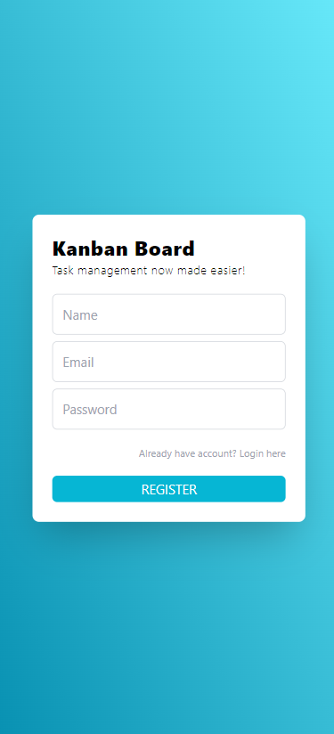

# KANBAN TASK BOARD

This is a simple task management app, where users can keep track of their day-to-day tasks effectively. They can also seamlessly drag and drop their tasks between categories of 'to-do','doing' or 'done' to organize them.
The front-end has been done with ReactJS and TailwindCSS. The backend has been done with Node,Express,Mongoose and MongoDB.

### User Login

### User Registration

### Home Page

### Drag and drop tasks

### Add Tasks

### Edit Tasks

### Delete Tasks

### Mobile Responsive Design

### API Methods for backend
